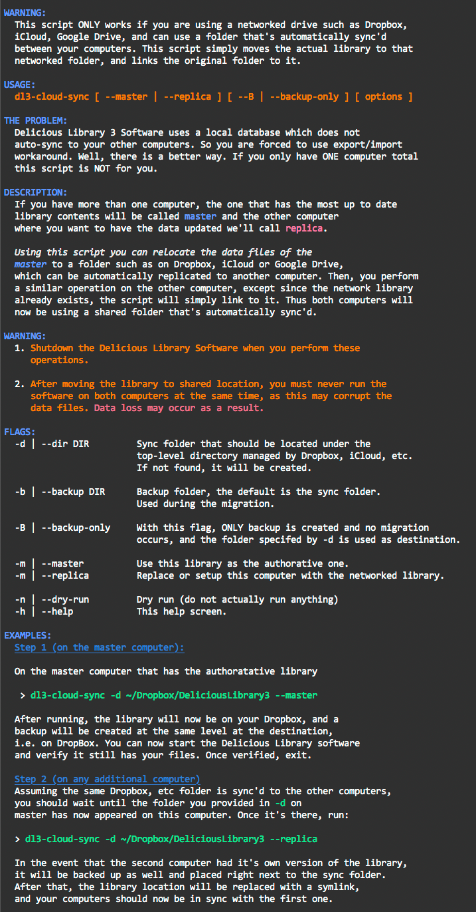

# Delicious Library 3™ — Unofficial Unsupported Cloud Sync

This is a simple shell script so that the data files used by Delicious Library 3™ 
software for Mac made by Delicious Monster Software can be shared across 
multiple computers in your possession.

## Rant

This software cost $38 and for this much money, seriously? I can't even auto-sync
my data between devices? Wat?

I can't link the books I own on Kindle or iBooks with Delicious Library? Wat?

I have more to say but time is short. 

## Acknowledgements

The [following thread](https://getsatisfaction.com/deliciousmonster/topics/sync_delicious_library_3_library_with_multiple_computers_cloud_features) oh GetSatisfaction.com.

## Using it

The idea is you must use DropBox, iCloud, Google Drive or something like that to move the files that the software uses to store it's data. This is what this script does.

Unfortunately, the authors did not address merging information, so if you change the same files on two computers at the same time, results are not predictable. So be careful and enjoy!

## Contributing

Bug reports and pull requests are welcome on GitHub at <https://github.com/kigster/delicious-library-3-cloud-sync>

## MIT LICENSE
 
Text of this license may be found here: <https://opensource.org/licenses/MIT>

Copyright © 2019 Konstantin Gredeskoul, all rights reserved.

Permission is hereby granted, free of charge, to any person obtaining 
a copy of this software and associated documentation files (the 
"Software"), to deal in the Software without restriction, including 
without limitation the rights to use, copy, modify, merge, publish, 
distribute, sublicense, and/or sell copies of the Software, and to 
permit persons to whom the Software is furnished to do so, subject to 
the following conditions:

The above copyright notice and this permission notice shall be 
included in all copies or substantial portions of the Software.

THE SOFTWARE IS PROVIDED "AS IS", WITHOUT WARRANTY OF ANY KIND, 
EXPRESS OR IMPLIED, INCLUDING BUT NOT LIMITED TO THE WARRANTIES OF 
MERCHANTABILITY, FITNESS FOR A PARTICULAR PURPOSE AND 
NONINFRINGEMENT. IN NO EVENT SHALL THE AUTHORS OR COPYRIGHT HOLDERS 
BE LIABLE FOR ANY CLAIM, DAMAGES OR OTHER LIABILITY, WHETHER IN AN 
ACTION OF CONTRACT, TORT OR OTHERWISE, ARISING FROM, OUT OF OR IN 
CONNECTION WITH THE SOFTWARE OR THE USE OR OTHER DEALINGS IN THE 
SOFTWARE.